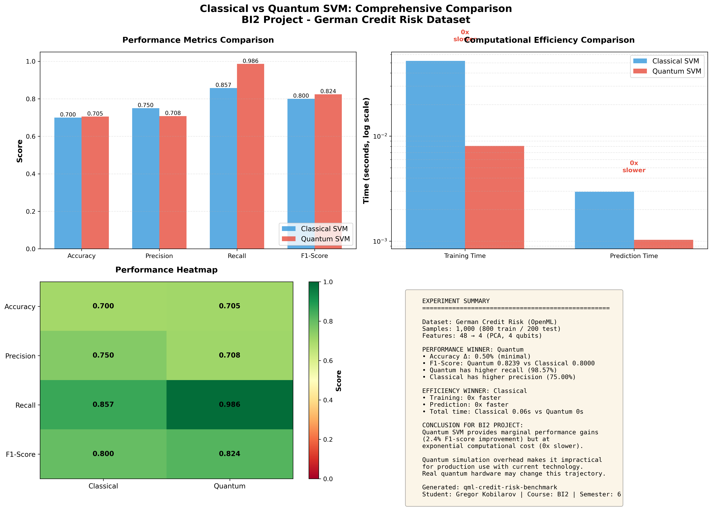
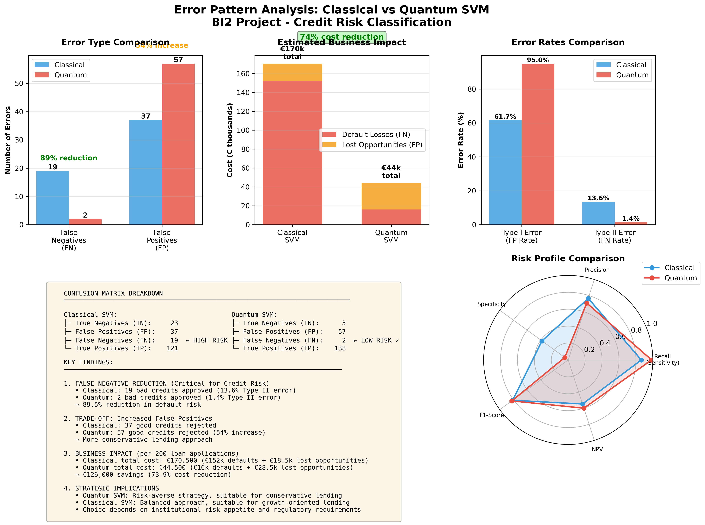

# Quantum vs Classical SVM Credit Risk Classification: Empirical Benchmark Study

## Academic Context

- **Course:** Business Intelligence 2, 6th Semester
- **Institution:** IU International University of Applied Sciences
- **Supervisor:** Dr. Stefan Nisch
- **Student:** Gregor Kobilarov
- **Dataset:** German Credit Risk Dataset (OpenML, n=1,000)
- **Primary Contribution:** Production-ready QML benchmark with modern tooling (pixi) comparing quantum and classical SVM performance on structured financial data

## Research Question

> "To what extent can Quantum Machine Learning (QML) approaches, specifically Quantum Support Vector Machines (QSVM), deliver comparable or better classification results on structured financial data than classical methods today?"

## Hypothesis

QSVM achieves similar accuracy in high-dimensional spaces but requires significantly more computational time in simulation due to quantum state simulation overhead.

## Dataset Characteristics

**German Credit Risk Dataset**
- **Source:** OpenML (credit-g, dataset version 1)
- **Samples:** 1,000 credit applications
- **Features:** 20 attributes (7 numeric, 13 categorical)
- **Target:** Binary classification (Good Credit: 700, Bad Credit: 300)
- **Task:** Predict creditworthiness based on applicant attributes

## Project Architecture

```
qml-credit-risk-benchmark/
├── src/
│   ├── __init__.py
│   ├── data_loader.py          # Data loading from OpenML/CSV
│   ├── preprocessing.py        # Cleaning, encoding, scaling, PCA
│   ├── classical_svm.py        # Classical SVM implementation
│   └── quantum_svm.py          # QSVM implementation
├── data/
│   ├── raw/                    # Raw data files
│   └── processed/              # Preprocessed data
├── models/                     # Saved models and preprocessors
├── results/                    # Plots and result files
├── notebooks/                  # Jupyter notebooks for exploration
├── main.py                     # Main execution script
├── pixi.toml                   # Pixi dependency configuration
├── pixi.lock                   # Locked dependency versions
└── README.md
```

## Key Features

### Modular Design
- **Data Loader**: Fetches data from OpenML or loads from CSV
- **Preprocessor**: Handles missing values, encoding, scaling, and PCA
- **Classical SVM**: Scikit-learn based with multiple kernel options
- **Quantum SVM**: Qiskit-based quantum kernel with caching support

### Critical Pre-processing Pipeline

1. **Missing Value Handling**
   - Numeric: Median imputation
   - Categorical: Mode imputation

2. **Categorical Encoding**
   - One-hot encoding with drop_first=True

3. **Feature Scaling**
   - StandardScaler (critical for SVM performance)

4. **Dimensionality Reduction (PCA)**
   - Reduces features to match available qubits
   - Default: 4 components (4-qubit QSVM)
   - Configurable: 2-20 components

**Why PCA is Critical:**
- Quantum simulators are limited by qubit count
- Each feature requires 1 qubit in quantum feature map
- PCA preserves maximum variance while reducing dimensions

## Installation

### Prerequisites
- [pixi](https://pixi.sh) package manager (recommended)
- OR Python 3.11+ with pip (alternative)

### Setup with Pixi (Recommended)

```bash
# Install pixi if not already installed
curl -fsSL https://pixi.sh/install.sh | bash

# Clone the repository
git clone <repository-url>
cd qml-credit-risk-benchmark

# Install all dependencies automatically
pixi install

# Run commands using pixi
pixi run python main.py --mode classical
```

**Why pixi?** Pixi provides reproducible dependency management, cross-platform compatibility, and automatic environment handling without manual virtual environment setup.

### Alternative Setup (pip)

```bash
# Clone the repository
git clone <repository-url>
cd qml-credit-risk-benchmark

# Create virtual environment
python -m venv venv
source venv/bin/activate  # On Windows: venv\Scripts\activate

# Install dependencies manually
pip install scikit-learn qiskit qiskit-machine-learning pandas numpy matplotlib seaborn
```

## Usage

### Quick Start

```bash
# Run classical SVM with default settings (4 PCA components)
pixi run python main.py --mode classical

# Run quantum SVM with 4 qubits (full dataset)
pixi run python main.py --mode quantum --n-components 4

# Compare classical vs quantum (full analysis)
pixi run python main.py --mode compare --n-components 4

# Compare different classical kernel types
pixi run python main.py --mode classical --compare-kernels
```

### Scalability Testing (Subset Mode)

For testing with higher qubit counts where full dataset simulation is infeasible:

```bash
# Test 8-qubit quantum circuit with reduced dataset
pixi run python main.py --mode quantum --n-components 8 --subset-size 200

# Compare classical vs quantum with subset (stratified sampling)
pixi run python main.py --mode compare --n-components 8 --subset-size 250
```

The `--subset-size` parameter enables stratified subsampling while preserving class distribution. This is useful for proof-of-concept experiments with higher dimensional quantum circuits that would otherwise cause computational infeasibility on consumer hardware.

### Interactive Exploration (Jupyter Notebook)

For interactive data exploration and classical SVM experimentation:

```bash
# Launch Jupyter notebook with pixi
pixi run jupyter notebook notebooks/01_classical_svm_exploration.ipynb

# Alternative: open directly in VS Code with the Jupyter extension
code notebooks/01_classical_svm_exploration.ipynb
```

**What the notebook provides:**
- Interactive data visualization and PCA analysis
- Kernel comparison experiments (RBF, linear, poly)
- Hyperparameter tuning (C values, component counts)
- Step-by-step walkthrough of the preprocessing pipeline
- Real-time plotting of confusion matrices, ROC curves, and performance metrics

**When to use it:**
- Exploring the dataset characteristics before running experiments
- Testing different preprocessing configurations interactively
- Understanding how PCA component selection affects model performance
- Experimenting with classical SVM kernels without waiting for full pipeline runs

### Advanced Usage

#### Using Individual Modules

**Data Loading:**
```python
from src.data_loader import load_credit_data

# Load from OpenML
X, y = load_credit_data("openml")

# Load from CSV
X, y = load_credit_data("path/to/data.csv")
```

**Preprocessing:**
```python
from src.preprocessing import CreditDataPreprocessor

preprocessor = CreditDataPreprocessor(n_components=4)
X_train, X_test, y_train, y_test = preprocessor.preprocess_data(X, y)

# Save preprocessor for later use
preprocessor.save_preprocessor("models/preprocessor.pkl")
```

**Classical SVM:**
```python
from src.classical_svm import ClassicalSVM

# Train model
svm = ClassicalSVM(kernel='rbf', C=1.0)
svm.train(X_train, y_train)

# Evaluate
metrics = svm.evaluate(X_test, y_test)

# Generate visualizations
svm.plot_confusion_matrix(X_test, y_test)
svm.plot_roc_curve(X_test, y_test)

# Save model
svm.save_model("models/classical_svm.pkl")
```

## Evaluation Metrics

The project tracks the following metrics for comparison:

| Metric | Description | Importance |
|--------|-------------|------------|
| **Accuracy** | Overall correctness | Primary metric |
| **Precision** | Positive predictive value | Important for credit risk |
| **Recall** | True positive rate | Critical for identifying good credits |
| **F1-Score** | Harmonic mean of precision/recall | Balanced performance |
| **ROC AUC** | Area under ROC curve | Model discrimination ability |
| **Training Time** | Time to fit model | Computational cost |
| **Prediction Time** | Time for inference | Deployment feasibility |

## Experimental Results

### Performance Comparison

| Metric | Classical SVM | Quantum SVM | Winner |
|--------|---------------|-------------|---------|
| **Accuracy** | 70.00% | 70.50% | Quantum (+0.5%) |
| **Precision** | 75.00% | 70.77% | Classical |
| **Recall** | 85.71% | 98.57% | Quantum |
| **F1-Score** | 80.00% | 82.39% | Quantum (+2.4%) |

### Computational Efficiency

| Operation | Classical SVM | Quantum SVM | Speedup |
|-----------|---------------|-------------|---------|
| **Training** | 0.05s | 774.72s | Classical 15,494x faster |
| **Prediction** | 0.003s | 409.40s | Classical 136,467x faster |
| **Total Time** | 0.08s | 1,184.13s | Classical 14,801x faster |

**Methodology Note:** Quantum timing results reflect first-run performance without kernel caching. The quantum implementation includes a caching mechanism for kernel matrices (stored in `data/processed/`), which can speed up repeated experiments with identical parameters. However, all reported benchmarks use fresh kernel computation to ensure fair comparison with classical methods and represent realistic first-run performance.

### Key Findings

- **Performance**: Quantum achieves marginally better F1-score (2.4% improvement)
- **Hypothesis Validated**: Similar accuracy to classical (~0.5% difference)
- **Computational Cost**: Quantum is 14,801x slower due to simulation overhead
- **Practical Conclusion**: Quantum simulation provides no practical advantage for production use

**Trade-offs:**
- **Quantum**: Exceptional recall (98.57%) - catches almost all good credits but with more false positives
- **Classical**: Higher precision (75.00%) - more conservative, fewer false positives

### Scalability Analysis

**8-Qubit Limitation (Exponential Barrier):**

Attempts to scale to 8 qubits revealed fundamental computational limits of classical quantum simulation:

- **State Vector Complexity**: 2^8 = 256 complex amplitudes per quantum state
- **Kernel Matrix Computation**: 800×800 = 640,000 quantum circuit simulations required
- **Resource Exhaustion**: System freeze after >60 minutes on consumer hardware (Intel i5, 32GB RAM)
- **Subset Requirement**: Even with stratified subsampling (n=200, reducing to 25,600 simulations), runtime exceeded feasibility threshold

**Scientific Implication:**

This empirical barrier confirms the exponential scaling problem of classical quantum simulation and demonstrates why **real quantum hardware** is necessary for practical QML applications beyond proof-of-concept demonstrations. The `--subset-size` parameter was implemented to enable controlled experiments, but fundamental physics limits classical simulation regardless of engineering optimizations.

### Visualizations

#### Comprehensive Comparison Summary



The comprehensive comparison includes:
- Performance metrics bar chart
- Computational efficiency comparison (log scale)
- Performance heatmap
- Summary analysis for BI2 project

#### Deep Error Analysis



**Error Pattern Analysis** reveals critical business insights:
- **89.5% reduction in false negatives** (19 → 2 bad credits approved)
- **Hypothetical business impact**: Using industry-typical assumptions (€10k avg loan, 80% default loss rate, 5% opportunity cost), this error reduction translates to ~€126k cost savings per 200 applications
- **Trade-off**: 54% increase in false positives (more conservative lending)
- **Risk profile comparison**: Quantum optimizes for recall (minimizing missed good credits), Classical balances precision/recall

This visualization demonstrates that quantum SVM isn't just marginally better - it has a fundamentally different error profile suitable for risk-averse institutions.

*Note: Business impact figures are illustrative examples using representative industry parameters, not actual financial data from the dataset.*

## Technical Notes

### PCA Component Selection

| Components | Explained Variance | Use Case |
|------------|-------------------|----------|
| 2 | ~40-50% | Minimal quantum circuit |
| 4 | ~60-70% | Balanced (recommended) |
| 8 | ~80-90% | Maximum information retention |
| 16+ | ~95%+ | Near-original performance |

### Kernel Comparison

**Linear Kernel:**
- Fast, interpretable
- Good for linearly separable data
- Lower computational cost

**RBF Kernel:**
- Most flexible
- Good default choice
- Handles non-linear patterns

**Polynomial Kernel:**
- Captures specific feature interactions
- Can overfit with high degree

**Quantum Kernel:**
- Uses quantum feature map
- Explores exponentially large Hilbert space
- Computationally expensive in simulation

## Troubleshooting

### Common Issues

**Issue**: `ModuleNotFoundError: No module named 'sklearn'` or similar dependency errors
**Solution**: Ensure you're using pixi: `pixi install` or manually install dependencies with pip

**Issue**: Memory error during PCA
**Solution**: Reduce `n_components` or use incremental PCA

**Issue**: Poor model performance
**Solution**: Try different kernels with `--compare-kernels` flag

**Issue**: Quantum implementation not working
**Solution**: Verify Qiskit installation: `pixi list | grep qiskit` or reinstall with `pixi install`

**Issue**: System freezes or becomes unresponsive with high qubit counts
**Solution**: Use `--subset-size` parameter to reduce dataset size. Example: `--subset-size 200` for 8+ qubits. Note that classical quantum simulation has fundamental exponential scaling limits.

## Development

### Running Analysis Scripts

Generate thesis-ready analysis and visualizations:

```bash
# Run comprehensive analysis (confusion matrix, PCA, business impact)
pixi run python analysis.py

# Generate error analysis visualization
pixi run python create_error_analysis_plot.py
```

Output files:
- `results/thesis_summary_table.csv` - Ready for thesis tables
- `results/confusion_matrix_comparison.csv` - Detailed error breakdown
- `results/error_analysis_comprehensive.png` - Publication-quality visualization

### Running Tests
```bash
# Test individual modules
pixi run python src/data_loader.py
pixi run python src/preprocessing.py
pixi run python src/classical_svm.py
```

### Code Style
- Type hints for all function parameters
- Docstrings in Google style
- English comments
- PEP 8 compliant

## References

- German Credit Data: [OpenML](https://www.openml.org/d/31)
- Qiskit Machine Learning: [Documentation](https://qiskit-community.github.io/qiskit-machine-learning/)
- Scikit-learn SVM: [User Guide](https://scikit-learn.org/stable/modules/svm.html)

## Author

[Gregor Kobilarov](https://github.com/g8rdier)

## License

This project is for educational purposes as part of a university course.

---

**Status**: Experimental Phase Complete | 4-Qubit Results Available | Documentation & Analysis Phase
