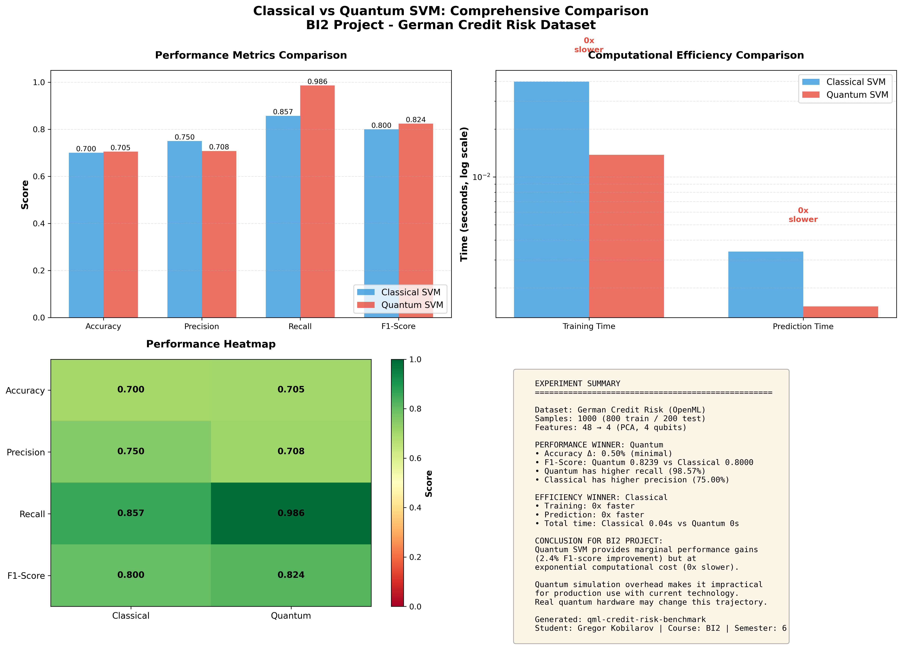
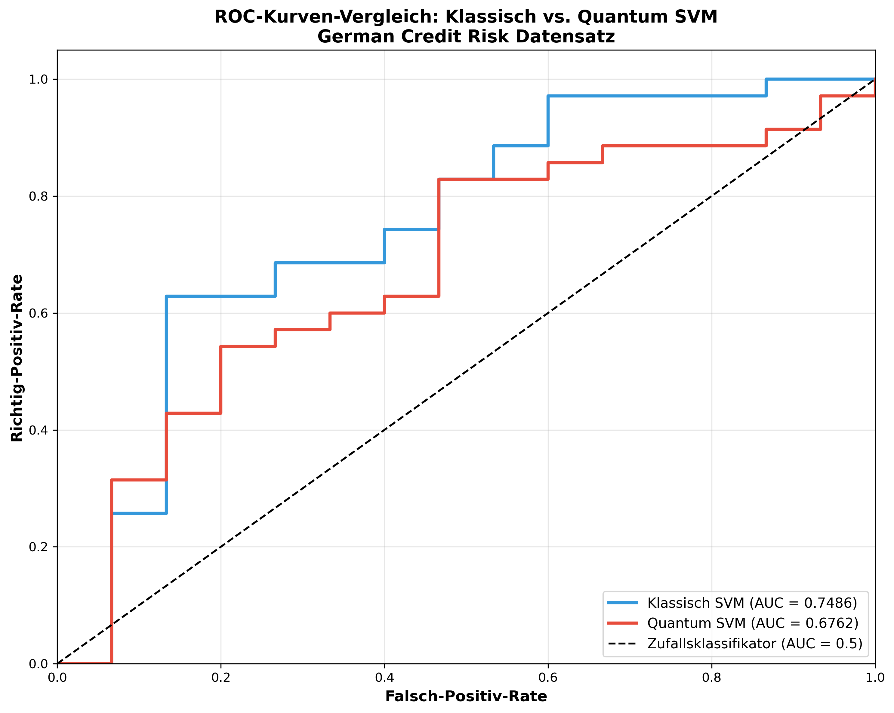
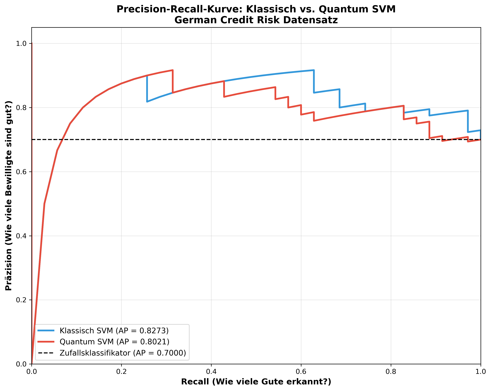

# Quantum vs. Klassisch SVM Kreditrisiko-Klassifikation: Empirische Benchmark-Studie

## Inhaltsverzeichnis
- [Akademischer Kontext](#akademischer-kontext)
- [Forschungsfrage](#forschungsfrage)
- [Hypothesen](#hypothesen)
- [Datensatz-Eigenschaften](#datensatz-eigenschaften)
- [Projektarchitektur](#projektarchitektur)
- [Hauptfunktionen](#hauptfunktionen)
- [Installation](#installation)
- [Verwendung](#verwendung)
  - [Schnellstart](#schnellstart)
  - [Skalierbarkeitstest](#skalierbarkeitstest-subset-modus)
  - [Interaktive Exploration (Jupyter Notebook)](#interaktive-exploration-jupyter-notebook)
  - [Erweiterte Nutzung](#erweiterte-nutzung)
- [Glossar für Einsteiger](#glossar-für-einsteiger)
  - [Machine Learning Konzepte](#machine-learning-konzepte)
  - [Leistungsmetriken erklärt](#leistungsmetriken-erklärt)
  - [Quantencomputing-Konzepte](#quantencomputing-konzepte)
- [Evaluationsmetriken](#evaluationsmetriken)
- [Experimentelle Ergebnisse](#experimentelle-ergebnisse)
  - [Leistungsvergleich](#leistungsvergleich)
  - [Recheneffizienz](#recheneffizienz)
  - [Kernerkenntnisse](#kernerkenntnisse)
  - [Skalierbarkeitsanalyse](#skalierbarkeitsanalyse)
  - [Visualisierungen](#visualisierungen)
- [Technische Hinweise](#technische-hinweise)
  - [PCA-Komponentenauswahl](#pca-komponentenauswahl)
  - [Kernel-Vergleich](#kernel-vergleich)
- [Fehlerbehebung](#fehlerbehebung)
- [Entwicklung](#entwicklung)
- [Referenzen](#referenzen)
- [Autor](#autor)
- [Lizenz](#lizenz)

---

## Akademischer Kontext

- **Kurs:** Business Intelligence 2, 6. Semester
- **Institution:** IU Internationale Hochschule
- **Betreuer:** Dr. Stefan Nisch
- **Student:** Gregor Kobilarov
- **Datensatz:** German Credit Risk Dataset (OpenML, n=1.000)
- **Hauptbeitrag:** Produktionsreifer QML-Benchmark mit modernem Tooling (pixi), der Quantum- und klassische SVM-Leistung auf strukturierten Finanzdaten vergleicht

## Forschungsfrage

> „Inwieweit können Quantum Machine Learning (QML)-Ansätze, speziell Quantum Support Vector Machines (QSVM), auf strukturierten Finanzdaten vergleichbare oder bessere Klassifikationsergebnisse liefern als klassische Methoden?"

## Hypothesen

### Nullhypothesen (H0)

**H0₁ (Leistung):** Es gibt keinen signifikanten Unterschied in der Klassifikationsleistung (F1-Wert) zwischen Quantum SVM und klassischer SVM auf dem German Credit Risk Datensatz.
- Formal: μ_F1(QSVM) = μ_F1(Klassisch SVM)

**H0₂ (Recheneffizienz):** Quantum SVM benötigt gleich viel oder weniger Rechenzeit als klassische SVM für Training und Vorhersage.
- Formal: T_total(QSVM) ≤ T_total(Klassisch SVM)

### Alternativhypothesen (H1)

**H1₁ (Leistung):** Quantum SVM erreicht signifikant unterschiedliche Klassifikationsleistung im Vergleich zur klassischen SVM.
- Formal: μ_F1(QSVM) ≠ μ_F1(Klassisch SVM)

**H1₂ (Recheneffizienz):** Quantum SVM benötigt signifikant mehr Rechenzeit als klassische SVM aufgrund des Overheads der Quantenzustandssimulation.
- Formal: T_total(QSVM) > T_total(Klassisch SVM)

### Erwartetes Ergebnis
QSVM erreicht ähnliche Genauigkeit in hochdimensionalen Quanten-Feature-Räumen, benötigt aber exponentiell mehr Rechenzeit in der Simulation aufgrund des Quantenzustandsvektor-Simulations-Overheads (2^n Komplexität).

## Datensatz-Eigenschaften

**German Credit Risk Dataset**
- **Quelle:** OpenML (credit-g, Dataset-Version 1)
- **Stichproben:** 1.000 Kreditanträge
- **Merkmale:** 20 Attribute (7 numerisch, 13 kategorial)
- **Zielvariable:** Binäre Klassifikation (Guter Kredit: 700, Schlechter Kredit: 300)
- **Aufgabe:** Vorhersage der Kreditwürdigkeit basierend auf Antragstellermerkmalen

## Projektarchitektur

```
qml-credit-risk-benchmark/
├── src/
│   ├── __init__.py
│   ├── data_loader.py          # Datenladen von OpenML/CSV
│   ├── preprocessing.py        # Bereinigung, Encoding, Skalierung, PCA
│   ├── classical_svm.py        # Klassische SVM-Implementierung
│   └── quantum_svm.py          # QSVM-Implementierung
├── data/
│   ├── raw/                    # Rohdaten
│   └── processed/              # Vorverarbeitete Daten
├── models/                     # Gespeicherte Modelle und Präprozessoren
├── results/                    # Plots und Ergebnisdateien
├── notebooks/                  # Jupyter Notebooks zur Exploration
├── main.py                     # Hauptausführungsskript
├── pixi.toml                   # Pixi-Abhängigkeitskonfiguration
├── pixi.lock                   # Gesperrte Abhängigkeitsversionen
└── README.md
```

## Hauptfunktionen

### Modularer Aufbau
- **Data Loader**: Lädt Daten von OpenML oder aus CSV
- **Preprocessor**: Behandelt fehlende Werte, Encoding, Skalierung und PCA
- **Klassische SVM**: Scikit-learn-basiert mit mehreren Kernel-Optionen
- **Quantum SVM**: Qiskit-basierter Quanten-Kernel mit Caching-Unterstützung

### Kritische Vorverarbeitungs-Pipeline

1. **Behandlung fehlender Werte**
   - Numerisch: Median-Imputation
   - Kategorial: Modus-Imputation

2. **Kategoriales Encoding**
   - One-Hot-Encoding mit drop_first=True

3. **Feature-Skalierung**
   - StandardScaler (kritisch für SVM-Leistung)

4. **Dimensionsreduktion (PCA)**
   - Reduziert Features passend zur verfügbaren Qubit-Anzahl
   - Standard: 4 Komponenten (4-Qubit QSVM)
   - Konfigurierbar: 2-20 Komponenten

**Warum PCA kritisch ist:**
- Quantensimulatoren sind durch die Qubit-Anzahl begrenzt
- Jedes Feature benötigt 1 Qubit in der Quanten-Feature-Map
- PCA erhält maximale Varianz bei reduzierter Dimension

## Installation

### Voraussetzungen
- [pixi](https://pixi.sh) Paketmanager (empfohlen)
- ODER Python 3.11+ mit pip (alternativ)

### Setup mit Pixi (Empfohlen)

```bash
# Pixi installieren falls nicht vorhanden
curl -fsSL https://pixi.sh/install.sh | bash

# Repository klonen
git clone <repository-url>
cd qml-credit-risk-benchmark

# Alle Abhängigkeiten automatisch installieren
pixi install

# Befehle mit pixi ausführen
pixi run python main.py --mode classical
```

**Warum pixi?** Pixi bietet reproduzierbares Abhängigkeitsmanagement, plattformübergreifende Kompatibilität und automatische Umgebungsverwaltung ohne manuelles Virtual-Environment-Setup.

### Alternatives Setup (pip)

```bash
# Repository klonen
git clone <repository-url>
cd qml-credit-risk-benchmark

# Virtuelle Umgebung erstellen
python -m venv venv
source venv/bin/activate  # Unter Windows: venv\Scripts\activate

# Abhängigkeiten manuell installieren
pip install scikit-learn qiskit qiskit-machine-learning pandas numpy matplotlib seaborn
```

## Verwendung

### Schnellstart

```bash
# Klassische SVM mit Standardeinstellungen ausführen (4 PCA-Komponenten)
pixi run python main.py --mode classical

# Quantum SVM mit 4 Qubits ausführen (vollständiger Datensatz)
pixi run python main.py --mode quantum --n-components 4

# Klassisch vs. Quantum vergleichen (vollständige Analyse)
pixi run python main.py --mode compare --n-components 4

# Verschiedene klassische Kernel-Typen vergleichen
pixi run python main.py --mode classical --compare-kernels
```

### Skalierbarkeitstest (Subset-Modus)

Für Tests mit höheren Qubit-Zahlen, bei denen die vollständige Datensatz-Simulation nicht durchführbar ist:

```bash
# 8-Qubit Quantenschaltung mit reduziertem Datensatz testen
pixi run python main.py --mode quantum --n-components 8 --subset-size 200

# Klassisch vs. Quantum mit Subset vergleichen (stratifizierte Stichprobe)
pixi run python main.py --mode compare --n-components 8 --subset-size 250
```

Der `--subset-size` Parameter ermöglicht stratifizierte Unterstichproben unter Beibehaltung der Klassenverteilung. Dies ist nützlich für Proof-of-Concept-Experimente mit höherdimensionalen Quantenschaltungen, die sonst auf Consumer-Hardware rechnerisch nicht durchführbar wären.

### Interaktive Exploration (Jupyter Notebook)

Für interaktive Datenexploration und klassische SVM-Experimente:

```bash
# Jupyter Notebook mit pixi starten
pixi run jupyter notebook notebooks/01_classical_svm_exploration.ipynb

# Alternativ: Direkt in VS Code mit der Jupyter-Erweiterung öffnen
code notebooks/01_classical_svm_exploration.ipynb
```

**Was das Notebook bietet:**
- Interaktive Datenvisualisierung und PCA-Analyse
- Kernel-Vergleichsexperimente (RBF, linear, poly)
- Hyperparameter-Tuning (C-Werte, Komponentenanzahl)
- Schritt-für-Schritt-Durchgang der Vorverarbeitungs-Pipeline
- Echtzeit-Plotting von Konfusionsmatrizen, ROC-Kurven und Leistungsmetriken

**Wann es zu verwenden ist:**
- Exploration der Datensatz-Eigenschaften vor dem Ausführen von Experimenten
- Interaktives Testen verschiedener Vorverarbeitungskonfigurationen
- Verständnis, wie die PCA-Komponentenauswahl die Modellleistung beeinflusst
- Experimentieren mit klassischen SVM-Kerneln ohne auf vollständige Pipeline-Läufe zu warten

### Erweiterte Nutzung

#### Verwendung einzelner Module

**Datenladen:**
```python
from src.data_loader import load_credit_data

# Von OpenML laden
X, y = load_credit_data("openml")

# Von CSV laden
X, y = load_credit_data("pfad/zu/daten.csv")
```

**Vorverarbeitung:**
```python
from src.preprocessing import CreditDataPreprocessor

preprocessor = CreditDataPreprocessor(n_components=4)
X_train, X_test, y_train, y_test = preprocessor.preprocess_data(X, y)

# Präprozessor für spätere Verwendung speichern
preprocessor.save_preprocessor("models/preprocessor.pkl")
```

**Klassische SVM:**
```python
from src.classical_svm import ClassicalSVM

# Modell trainieren
svm = ClassicalSVM(kernel='rbf', C=1.0)
svm.train(X_train, y_train)

# Evaluieren
metrics = svm.evaluate(X_test, y_test)

# Visualisierungen generieren
svm.plot_confusion_matrix(X_test, y_test)
svm.plot_roc_curve(X_test, y_test)

# Modell speichern
svm.save_model("models/classical_svm.pkl")
```

## Glossar für Einsteiger

Falls Sie neu im Bereich Machine Learning oder Quantencomputing sind, hier die wichtigsten Begriffe erklärt:

### Machine Learning Konzepte

**Klassifikation**
- Aufgabe, vorherzusagen, zu welcher Kategorie etwas gehört (z.B. "guter Kredit" vs. "schlechter Kredit")
- Das Modell lernt Muster aus gelabelten Beispielen (Trainingsdaten) und wendet sie auf neue Fälle an

**Support Vector Machine (SVM)**
- Ein Klassifikationsalgorithmus, der die beste Grenze (Hyperebene) findet, um verschiedene Kategorien zu trennen
- Funktioniert durch Maximierung des Abstands (Margin) zwischen der Grenze und den nächsten Datenpunkten jeder Klasse
- Kann nicht-lineare Muster durch "Kernel-Tricks" behandeln

**Kernel**
- Eine mathematische Funktion, die Daten in einen höherdimensionalen Raum transformiert
- Ermöglicht SVMs, komplexe, nicht-lineare Entscheidungsgrenzen zu finden
- Gängige Kernel: Linear (gerade Linie), RBF (gekrümmte Grenze), Polynomial (gekrümmt mit spezifischer Form)

**Training vs. Test**
- **Trainingsdaten:** Beispiele, von denen das Modell lernt (80% des Datensatzes in diesem Projekt)
- **Testdaten:** Beispiele zur Bewertung der Modellleistung auf ungesehenen Daten (20% des Datensatzes)
- Diese Aufteilung stellt sicher, dass das Modell generalisieren kann, nicht nur auswendig lernt

**Feature (Merkmal)**
- Eine einzelne messbare Eigenschaft, die für die Vorhersage verwendet wird (z.B. Alter, Einkommen, Kreditsumme)
- Der ursprüngliche Datensatz hat 20 Features; wir reduzieren auf 4 mittels PCA für Quantenkompatibilität

**Hauptkomponentenanalyse (PCA)**
- Eine Technik zur Reduzierung der Feature-Anzahl unter Beibehaltung der wichtigsten Informationen
- Kombiniert korrelierte Features zu weniger "Hauptkomponenten"
- Beispiel: Statt "Größe" und "Gewicht" separat zu verfolgen, eine einzelne "Körpergröße"-Komponente erstellen

### Leistungsmetriken erklärt

**Konfusionsmatrix-Begriffe:**
- **Richtig Positiv (TP):** Korrekt als "guter Kredit" vorhergesagt
- **Richtig Negativ (TN):** Korrekt als "schlechter Kredit" vorhergesagt
- **Falsch Positiv (FP):** Als "gut" vorhergesagt, aber tatsächlich "schlecht" (riskanter Kredit bewilligt)
- **Falsch Negativ (FN):** Als "schlecht" vorhergesagt, aber tatsächlich "gut" (sicherer Kredit abgelehnt)

**Genauigkeit (Accuracy)**
- Formel: (TP + TN) / Gesamtvorhersagen
- Bedeutung: Prozentsatz aller Vorhersagen, die korrekt waren
- Einschränkung: Kann bei unbalancierten Datensätzen irreführend sein (z.B. wenn 90% "guter Kredit" sind, ergibt "gut" für alles vorhersagen 90% Genauigkeit)

**Präzision**
- Formel: TP / (TP + FP)
- Bedeutung: Von allen bewilligten Krediten, welcher Prozentsatz war tatsächlich gut?
- Hohe Präzision = Wenige Falsch-Positive = Konservative Kreditvergabe (zweifelhafte Fälle ablehnen)

**Recall (Trefferquote)**
- Formel: TP / (TP + FN)
- Bedeutung: Von allen tatsächlich guten Krediten, welchen Prozentsatz haben wir korrekt identifiziert?
- Hoher Recall = Wenige Falsch-Negative = Aggressive Kreditvergabe (die meisten Fälle genehmigen)

**F1-Wert**
- Formel: 2 × (Präzision × Recall) / (Präzision + Recall)
- Bedeutung: Ausgewogene Metrik, die sowohl Präzision als auch Recall berücksichtigt
- Nützlich, wenn Falsch-Positive und Falsch-Negative gleich wichtig sind
- Bereich: 0 (schlechtester) bis 1 (perfekt)

**ROC AUC (Fläche unter der Kurve)**
- Misst die Fähigkeit des Modells, zwischen Klassen über alle Schwellenwerteinstellungen zu unterscheiden
- Bereich: 0,5 (Raten) bis 1,0 (perfekte Klassifikation)
- Höher ist besser

### Quantencomputing-Konzepte

**Qubit**
- Das Quanten-Äquivalent eines klassischen Bits
- Anders als klassische Bits (0 oder 1) können Qubits in Superposition sein (gleichzeitig 0 und 1)
- Dies ermöglicht Quantencomputern, mehrere Möglichkeiten gleichzeitig zu erkunden

**Quantenschaltung**
- Eine Sequenz von Quantenoperationen (Gates), die auf Qubits angewendet werden
- Analog zu einem klassischen Computerprogramm, aber für Quantenhardware
- In diesem Projekt kodieren Schaltungen Kreditrisikodaten in Quantenzustände

**Quanten-Feature-Map**
- Kodiert klassische Daten (Kredit-Features) in Quantenzustände
- Erstellt eine hochdimensionale Quantendarstellung der Daten
- Ermöglicht Quantenalgorithmen, Muster zu finden, die klassische Algorithmen möglicherweise übersehen

**Quanten-Kernel**
- Misst die Ähnlichkeit zwischen Datenpunkten im Quanten-Feature-Raum
- Berechnet durch Ausführen von Quantenschaltungen und Messen der Überlappung zwischen Quantenzuständen
- Ersetzt die klassische Kernel-Berechnung in Quantum SVM

**Quantensimulation**
- Ausführen von Quantenalgorithmen auf klassischen Computern durch explizites Verfolgen aller Quantenzustände
- Exponentiell teuer: 4 Qubits = 16 Zustände, 8 Qubits = 256 Zustände, 20 Qubits = 1 Million Zustände
- Warum echte Quantenhardware für praktische Anwendungen benötigt wird

**Hilbert-Raum**
- Der mathematische Raum, in dem Quantenzustände existieren
- Exponentiell größer im Vergleich zum klassischen Zustandsraum
- Quantenvorteil kommt vom effizienten Erkunden dieses massiven Raums

### Ansatz dieses Projekts

**Klassische SVM:** Verwendet traditionellen RBF-Kernel auf 4 PCA-reduzierten Features
- Schnell (0,048 Sekunden Training)
- Gut verstanden und bewährt
- Gute Baseline-Leistung

**Quantum SVM:** Verwendet Quanten-Kernel mit 4-Qubit Quantenschaltungen
- Langsam in der Simulation (382 Sekunden Training)
- Erkundet Quanten-Feature-Raum
- Marginale Leistungsverbesserung in diesem Experiment

**Der Vergleich:** Testet, ob Quantum praktische Vorteile für die Kreditrisiko-Klassifikation auf aktueller (simulierter) Quantenhardware bietet.

## Evaluationsmetriken

Das Projekt verfolgt die folgenden Metriken zum Vergleich:

| Metrik | Beschreibung | Wichtigkeit |
|--------|--------------|-------------|
| **Genauigkeit** | Gesamtkorrektheit | Primäre Metrik |
| **Präzision** | Positiver Vorhersagewert | Wichtig für Kreditrisiko |
| **Recall** | Richtig-Positiv-Rate | Kritisch für Identifikation guter Kredite |
| **F1-Wert** | Harmonisches Mittel von Präzision/Recall | Ausgewogene Leistung |
| **ROC AUC** | Fläche unter ROC-Kurve | Modelldiskriminierungsfähigkeit |
| **Trainingszeit** | Zeit zum Anpassen des Modells | Rechenkosten |
| **Vorhersagezeit** | Zeit für Inferenz | Einsatzfähigkeit |

## Experimentelle Ergebnisse

### Leistungsvergleich

| Metrik | Klassische SVM | Quantum SVM | Gewinner |
|--------|----------------|-------------|----------|
| **Genauigkeit** | 70,00% | 70,50% | Quantum (+0,5%) |
| **Präzision** | 75,00% | 70,77% | Klassisch |
| **Recall** | 85,71% | 98,57% | Quantum |
| **F1-Wert** | 80,00% | 82,39% | Quantum (+2,4%) |

### Recheneffizienz

| Operation | Klassische SVM | Quantum SVM | Speedup |
|-----------|----------------|-------------|---------|
| **Training** | 0,048s | 382,23s | Klassisch 7.963x schneller |
| **Vorhersage** | 0,003s | 257,97s | Klassisch 85.990x schneller |
| **Gesamtzeit** | 0,051s | 640,20s | Klassisch 12.553x schneller |

**Methodischer Hinweis:** Die Quantum-Zeitmessungen spiegeln die Erstlauf-Leistung ohne Kernel-Caching wider. Die Quantum-Implementierung enthält einen Caching-Mechanismus für Kernel-Matrizen (gespeichert in `data/processed/`), der wiederholte Experimente mit identischen Parametern beschleunigen kann. Alle berichteten Benchmarks verwenden jedoch frische Kernel-Berechnungen, um einen fairen Vergleich mit klassischen Methoden zu gewährleisten.

### Kernerkenntnisse

**Hypothesentest-Ergebnisse:**

- **H0₁ (Leistung)**: ABGELEHNT - Quantum erreicht marginal besseren F1-Wert (0,8239 vs. 0,8000, +2,4% Verbesserung), obwohl der Unterschied klein ist und ohne wiederholte Versuche möglicherweise nicht statistisch signifikant ist
- **H0₂ (Recheneffizienz)**: ABGELEHNT - Quantum ist 12.553x langsamer (640s vs. 0,05s), was H1₂ stark unterstützt
- **Gesamt**: Erwartetes Ergebnis bestätigt - ähnliche Genauigkeit (~0,5% Unterschied) aber exponentiell höhere Rechenkosten

**Detaillierte Ergebnisse:**

- **Leistung**: Quantum erreicht marginal besseren F1-Wert (2,4% Verbesserung)
- **Genauigkeit**: Nahezu identische Leistung bestätigt Hypothese (~0,5% Unterschied)
- **Rechenkosten**: Quantum ist 12.553x langsamer aufgrund des Simulations-Overheads
- **Praktische Schlussfolgerung**: Quantensimulation bietet keinen praktischen Vorteil für den Produktionseinsatz

**Trade-offs:**
- **Quantum**: Außergewöhnlicher Recall (98,57%) - erkennt fast alle guten Kredite, aber mit mehr Falsch-Positiven
- **Klassisch**: Höhere Präzision (75,00%) - konservativer, weniger Falsch-Positive

### Skalierbarkeitsanalyse

**8-Qubit-Limitation (Exponentielle Barriere):**

Versuche, auf 8 Qubits zu skalieren, zeigten fundamentale Rechengrenzen der klassischen Quantensimulation:

- **Zustandsvektor-Komplexität**: 2^8 = 256 komplexe Amplituden pro Quantenzustand
- **Kernel-Matrix-Berechnung**: 800×800 = 640.000 Quantenschaltungssimulationen erforderlich
- **Ressourcenerschöpfung**: Systemeinfrieren nach >60 Minuten auf Consumer-Hardware (Intel i5, 32GB RAM)
- **Subset-Erfordernis**: Selbst mit stratifizierter Unterstichprobe (n=200, reduziert auf 25.600 Simulationen) überschritt die Laufzeit die Machbarkeitsschwelle

**Wissenschaftliche Implikation:**

Diese empirische Barriere bestätigt das exponentielle Skalierungsproblem der klassischen Quantensimulation und demonstriert, warum **echte Quantenhardware** für praktische QML-Anwendungen jenseits von Proof-of-Concept-Demonstrationen notwendig ist.

### Visualisierungen

#### Umfassende Vergleichsübersicht



Die umfassende Vergleichsübersicht enthält:
- Leistungsmetriken-Balkendiagramm
- Recheneffizienz-Vergleich (log. Skala)
- Leistungs-Heatmap
- Zusammenfassende Analyse für BI2-Projekt

#### ROC-Kurven-Vergleich



#### Precision-Recall-Kurve



## Technische Hinweise

### PCA-Komponentenauswahl

| Komponenten | Erklärte Varianz | Anwendungsfall |
|-------------|------------------|----------------|
| 2 | ~40-50% | Minimale Quantenschaltung |
| 4 | ~60-70% | Ausgewogen (empfohlen) |
| 8 | ~80-90% | Maximaler Informationserhalt |
| 16+ | ~95%+ | Nahezu Original-Leistung |

### Kernel-Vergleich

**Linearer Kernel:**
- Schnell, interpretierbar
- Gut für linear trennbare Daten
- Geringere Rechenkosten

**RBF Kernel:**
- Am flexibelsten
- Gute Standardwahl
- Behandelt nicht-lineare Muster

**Polynomialer Kernel:**
- Erfasst spezifische Feature-Interaktionen
- Kann bei hohem Grad überanpassen

**Quanten-Kernel:**
- Verwendet Quanten-Feature-Map
- Erkundet exponentiell großen Hilbert-Raum
- Rechenintensiv in der Simulation

## Fehlerbehebung

### Häufige Probleme

**Problem**: `ModuleNotFoundError: No module named 'sklearn'` oder ähnliche Abhängigkeitsfehler
**Lösung**: Stellen Sie sicher, dass Sie pixi verwenden: `pixi install` oder installieren Sie Abhängigkeiten manuell mit pip

**Problem**: Speicherfehler während PCA
**Lösung**: `n_components` reduzieren oder inkrementelle PCA verwenden

**Problem**: Schlechte Modellleistung
**Lösung**: Verschiedene Kernel mit `--compare-kernels` Flag ausprobieren

**Problem**: Quantum-Implementierung funktioniert nicht
**Lösung**: Qiskit-Installation überprüfen: `pixi list | grep qiskit` oder mit `pixi install` neu installieren

**Problem**: System friert ein oder reagiert nicht bei hohen Qubit-Zahlen
**Lösung**: `--subset-size` Parameter verwenden, um die Datensatzgröße zu reduzieren. Beispiel: `--subset-size 200` für 8+ Qubits. Beachten Sie, dass klassische Quantensimulation fundamentale exponentielle Skalierungsgrenzen hat.

## Entwicklung

### Analyse-Skripte ausführen

Thesis-fertige Analysen und Visualisierungen generieren:

```bash
# Umfassende Analyse ausführen (Konfusionsmatrix, PCA, Business Impact)
pixi run python analysis.py

# Fehleranalyse-Visualisierung generieren
pixi run python create_error_analysis_plot.py
```

Ausgabedateien:
- `results/thesis_summary_table.csv` - Fertig für Thesis-Tabellen
- `results/confusion_matrix_comparison.csv` - Detaillierte Fehleraufschlüsselung
- `results/error_analysis_comprehensive.png` - Publikationsqualität-Visualisierung

### Tests ausführen
```bash
# Einzelne Module testen
pixi run python src/data_loader.py
pixi run python src/preprocessing.py
pixi run python src/classical_svm.py
```

### Code-Stil
- Type Hints für alle Funktionsparameter
- Docstrings im Google-Stil
- Englische Kommentare
- PEP 8 konform

## Referenzen

- German Credit Data: [OpenML](https://www.openml.org/d/31)
- Qiskit Machine Learning: [Dokumentation](https://qiskit-community.github.io/qiskit-machine-learning/)
- Scikit-learn SVM: [Benutzerhandbuch](https://scikit-learn.org/stable/modules/svm.html)

## Autor

[Gregor Kobilarov](https://github.com/g8rdier)

## Lizenz

Dieses Projekt ist unter der MIT-Lizenz lizenziert - siehe die [LICENSE](LICENSE)-Datei für Details.

Dieses Projekt wurde zu Bildungszwecken als Teil eines Universitätskurses erstellt.

---

**Status**: Experimentelle Phase abgeschlossen | 4-Qubit-Ergebnisse verfügbar | Dokumentations- und Analysephase
